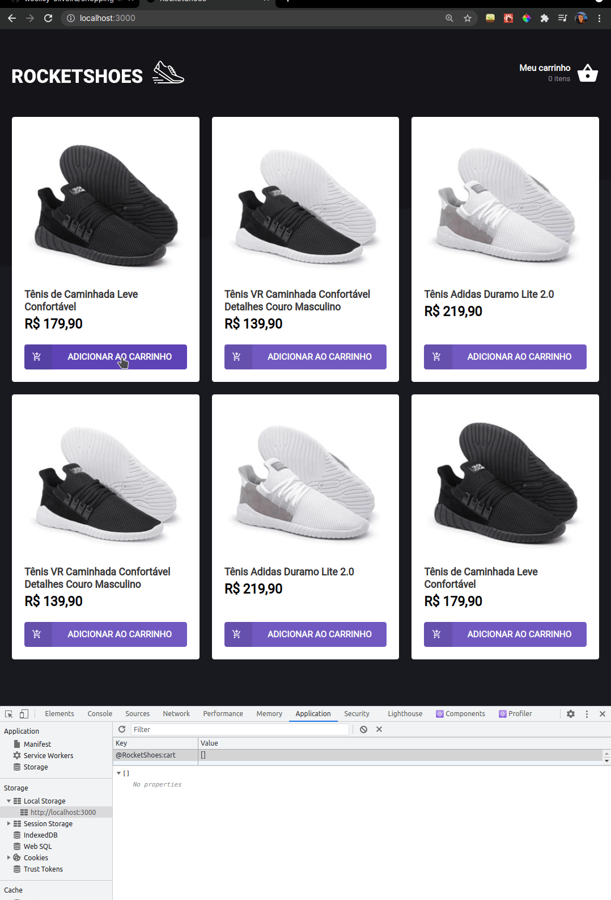

<h1 align="center">
    
</h1>

  <a href="#-preview">Preview</a>&nbsp;&nbsp;&nbsp;|&nbsp;&nbsp;&nbsp;
  <a href="#technologies">Technologies</a>&nbsp;&nbsp;&nbsp;|&nbsp;&nbsp;&nbsp;
  <a href="#-project">Project</a>&nbsp;&nbsp;&nbsp;

## 🔥 Preview

  

   

 

## 🧪 Technologies

This project was developed using the following technologies:

- [React Js]()
- [TypeScript](https://www.typescriptlang.org/)
- [JSON Server]()
- [Axios]()
- [Styled-components]()

## 💻 Project

Small application to train the main fundamentals of React Js and Typescript.
in this project I implemented all the logic of a market cart

##### What is it possible to do?

- Add new products to the cart
- Change item quantity 
- Remove the items

##### What was improved in this project?
- Use of fake JSON-server API
- Stock validation
- The logic of summing the values
- Save data to LocalStorage
- Library use [React-toastify](https://fkhadra.github.io/react-toastify/introduction)

---

Made with 💜 by Weslley Oliveira

